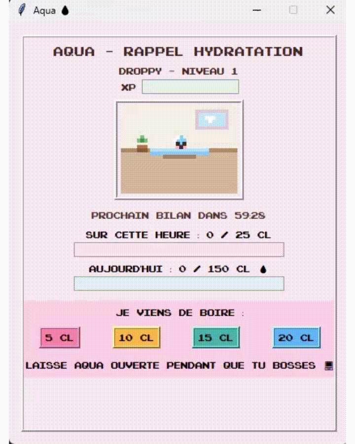

# 💧 Aqua

**Aqua** is a cute desktop hydration reminder built with Python and Tkinter.  
The idea is simple: keep a small pixel-art water drop companion open while working, log how much water you drink, and let Aqua help you stay consistent throughout the day.

<p align="center">
  <em>A cute pixel-art hydration tracker for focused work sessions.</em>
</p>

---

## 🎬 Demo

<p align="center">
  
</p>

---

## ✨ Overview

Aqua is a small personal productivity and wellness app designed to make hydration tracking more fun and visual.

Instead of using a basic reminder, Aqua gives the user a little pixel-art water drop companion.  
The app tracks how much water has been consumed during the current hour and during the day, compares it with hydration goals, and gives visual feedback through mood, XP, levels, and reminders.

This project was mainly built as a playful Python GUI project, with a focus on:

- desktop application development with Tkinter;
- simple state management;
- countdown timer logic;
- custom pixel-art interface;
- gamification through XP and levels;
- clean separation between UI, configuration, and core logic.

---

## ✨ Features

- 💧 **Hydration tracking** in centiliters  
- ⏱️ **Countdown timer** for regular hydration checks  
- 🎯 **Hourly and daily hydration goals**  
- 📊 **Progress bars** for hourly intake, daily intake, and XP  
- 🌱 **XP and level system** based on consistency  
- 😊 **Pixel-art water drop companion** with different moods  
- 📝 **Custom name** for the water drop companion  
- 🎮 **cute / retro pixel-art interface**  
- 🪟 **Lightweight desktop app** built with Tkinter  

---

## 🛠️ Tech Stack

| Tool | Use |
|---|---|
| Python | Main programming language |
| Tkinter | Desktop graphical interface |
| ttk | Progress bars and UI widgets |
| Custom pixel art | Visual identity and app design |
| Modular Python structure | Separation between timer logic, UI, and configuration |

---

## 📁 Project Structure

```text
Aqua/
│
├── main.py              # Application entry point
├── config.py            # Window size, colors and hydration goals
│
├── core/
│   ├── __init__.py
│   └── timer.py         # Countdown timer logic
│
├── ui/
│   ├── __init__.py
│   ├── app.py           # Main Tkinter application
│   ├── pixel_art.py     # Pixel-art related file
│   └── fonts/
│       └── Pixel_NES    # Pixel font used in the interface
│
├── assets/
│   └── aqua-demo.gif    # App demo GIF
│
└── README.md
```

---

## 🚀 How to Run

### 1. Clone the repository

```bash
git clone https://github.com/Sharon-py/Aqua.git
cd Aqua
```

### 2. Run the application

```bash
python main.py
```

If `python` does not work on Windows, try:

```bash
py main.py
```

No complex setup is required.  
The project only uses Python’s standard GUI library, Tkinter.

---

## ⚙️ Configuration

The main parameters can be changed in `config.py`:

```python
WINDOW_WIDTH = 420
WINDOW_HEIGHT = 520
WINDOW_TITLE = "Aqua"

DEFAULT_INTERVAL_MIN = 60
HOURLY_GOAL_CL = 25
DAILY_GOAL_CL = 150
```
---

## 🎮 How It Works

1. When the app starts, the user can give a name to the water drop companion.
2. The user logs water intake using buttons such as `5 cl`, `10 cl`, `15 cl`, and `20 cl`.
3. Aqua tracks progress toward the hourly and daily hydration goals.
4. At the end of each interval, the app checks whether the hourly goal has been reached.
5. If the goal is reached, Aqua gains XP and can level up.
6. If the goal is missed, Aqua becomes sad and the level can decrease.
7. The visual appearance of the drop evolves with the level.

---

## 🧠 What I Practiced

This project helped me practice several software development concepts in a small but concrete application:

- building a desktop app with Tkinter;
- structuring a Python project into separate modules;
- managing UI state and callbacks;
- creating a countdown system;
- designing simple gamification mechanics;
- working on visual details and user experience;
- turning a small everyday need into an interactive tool.

---

## 🔮 Possible Improvements

Some ideas for future versions:

- add persistent storage to save daily progress;
- allow custom hydration goals from the UI;
- add sound notifications;
- improve the pixel-art animations;
- package the app as a Windows executable;
- add more visual states for the water drop companion.

---

## 📌 Status

This is a small personal project built to explore Python desktop applications and playful UI design.  
---

## 👩‍💻 Author

**Sharon**  
Data science & Python projects  

- GitHub: [Sharon-py](https://github.com/Sharon-py)
